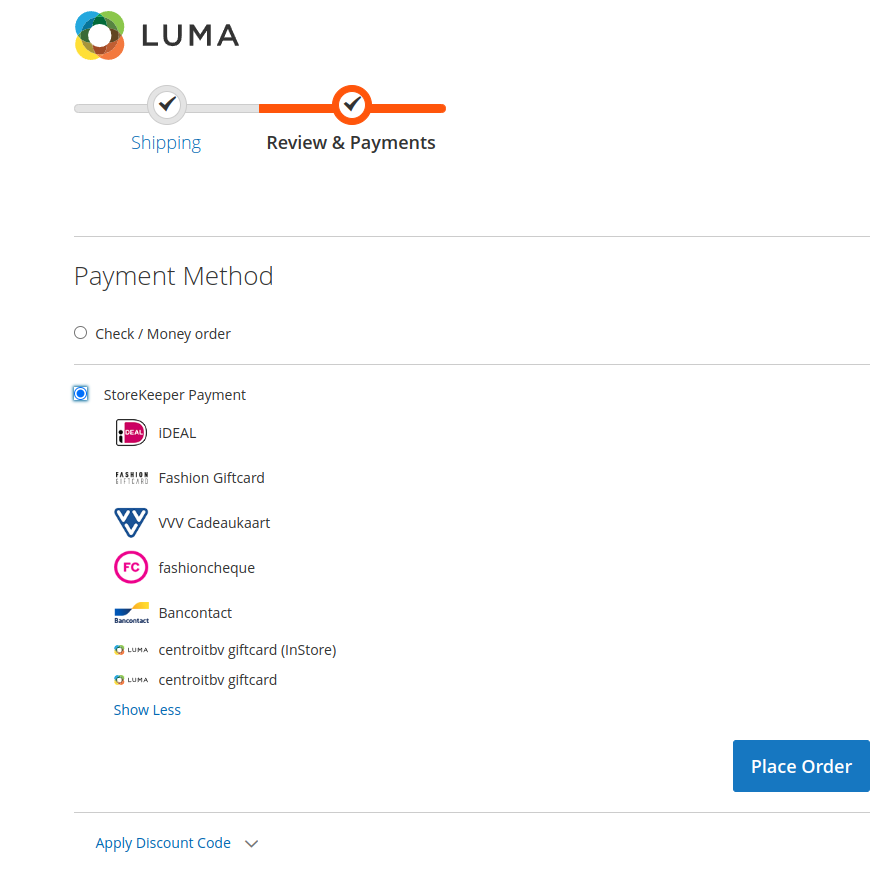
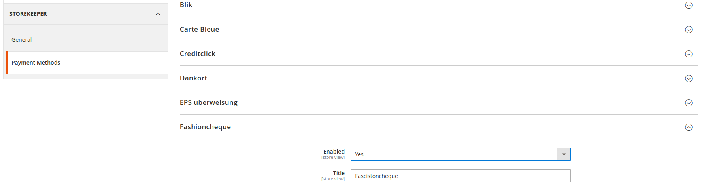
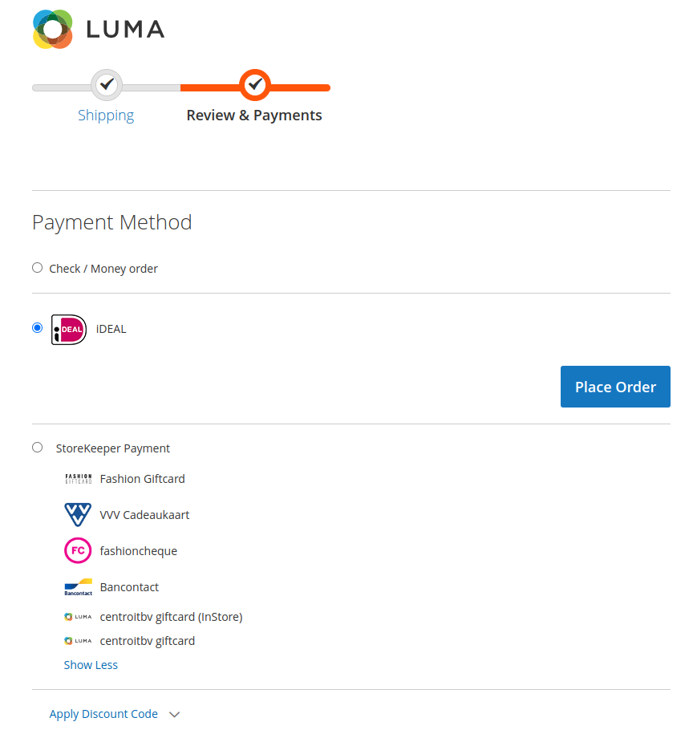

# Description

Connect your Magento 2 stores to StoreKeeper.

# Important Notice

Before using module make sure that your shop have all tax rules, classes and rates configured accordingly to your shop's region. Please follow this [official Magento guide](https://experienceleague.adobe.com/docs/commerce-admin/stores-sales/site-store/taxes/international-tax-guidelines.html#eu-tax-configuration).

# Installation

1. Go to your Magento 2 directory and install the plugin via `composer`:
```
composer require storekeeper/magento2-plugin
```

2. Recompile your Magento 2 installation by running:
```
bin/magento setup:upgrade;
bin/magento setup:di:compile;
bin/magento setup:static-content:deploy;
bin/magento cache:clean;
```

# Configuration

1. Log into your Magento 2 backend and go to `Stores` > `Configuration` > `StoreKeeper` > `General`

2. Select your store by navigating to the deepest level in the top left store navigation

3. Enable the plugin by setting the field `Enabled` to `Yes`

6. Copy your `Auth Key`

7. Press the `Save` button

8. Log into your StoreKeeper account

9. Select the StoreKeeper Sales Channel you want to connect with

10. Go to `Settings`

11. Scroll down to the `Synchronisation` button and click it

12. Paste the `Auth Key` you previously copied from Magento 2 into the `Api Key` field and click `Connect`

13. Once succesfully connected, the fields in your Magento 2 backend should be filled with data

## Payment Methods Configuration
Payment methods awaylable via Storekeeper Payment Gateway can be activated in two places:
 1. As an option of **StoreKeeper Payments** payment method, available under:<br/>
_Stores->Configuration->Sales->Payment Methods->Other Payment Methods->**StoreKeeper Payments** (Yes/No)_

In this case customer will see all Payment options activated on their storekeeper account.

2. As separate Payment option:<br/>
In order to display in Magento Checkout any of Payment Methods available on storekeeper account as an individual payment option, admin user needs to activate  method under:<br />
_Stores->Configuration->Storekeeper->**StoreKeeper Payments**_


In this case activated Payment Method(s) will appear as individual Payment Method option, and dissapear as sub-option on **StoreKeeper Payments**


_Payment methods that does not have own logo will receive current store logo set in Content->Design->Configuration area of Magento admin panel_ 

## Queue

This plugin uses the Magento 2 queue consumer functionality. If you want to run the queue manually you can use the following command:

```
bin/magento queue:consumer:start storekeeper.queue.events
```

# Disconnecting

Disconnecting your Magento 2 store can be done in two ways

## Disconnect from StoreKeeper

1. Log into your StoreKeeper environment

2. Select your StoreKeeper Sales Channel

3. Go to `Settings` 

4. Scroll down to the `Disconnect` button and click it

## Disconnect from Magento 2 

1. Log into your Magento 2 backend

2. Log into your Magento 2 backend and go to `Stores` > `Configuration` > `StoreKeeper` > `General`

3. Select your store by navigating to the deepest level in the top left store navigation

4. Empty the value in the `Token` field

5. Press the `Save` button

# Debugging

If you're having any issues using the plugin, the first thing to do would be checking the `magento2/var/log/storekeeper.log` for any errors.

# Running integration tests

1. Prepare your enviroment according to Magento 2 integration testing documentation https://developer.adobe.com/commerce/testing/guide/integration/

2. To run integration tests from a specific directory tree in Magento 2, use the following command:
```
cd dev/tests/integration

../../../vendor/bin/phpunit ../../../vendor/storekeeper/magento2-plugin/Test/Integration
```

2. To run a single test class in Magento 2, use the following command:
```
cd dev/tests/integration

../../../vendor/bin/phpunit ../../../vendor/storekeeper/magento2-plugin/Test/Integration/OrderCreationTest.php
```
